# 生产数据库设计文档

> 本文档是「智能检测报告生成系统」后端 Phase 2 数据库迁移的核心参考，覆盖 ER 建模、DDL、规范化决策、迁移策略、索引规划、软删除策略与时戳规范。所有表结构面向 **PostgreSQL**（SQLAlchemy 2.0 + asyncpg），遵循 `backend/docs/后端开发规范.md` 与 `backend/docs/技术栈说明.md` 的分层与命名约束。

---

## 目录

1. [ER 关系图（Mermaid）](#1-er-关系图mermaid)
2. [完整 DDL](#2-完整-ddl)
3. [JSONB vs 规范化决策](#3-jsonb-vs-规范化决策)
4. [迁移策略](#4-迁移策略)
5. [索引策略](#5-索引策略)
6. [软删除策略](#6-软删除策略)
7. [时戳规范](#7-时戳规范)

---

## 1. ER 关系图（Mermaid）

下图包含全部 **18 个实体**，覆盖当前 `data/*.json` 的 18 张轻量数据表（含 3 个复合键 JSON 的规范化结果，以及 `RuleTemplate.fields` 的独立展开）。主键以 `PK` 标注，外键以 `FK` 标注，关联 cardinality 使用 Mermaid 标准符号。

```mermaid
erDiagram
    users {
        varchar id PK
        varchar name
        varchar role
        varchar department
        varchar status
        timestamptz last_login
        timestamptz created_at
        timestamptz updated_at
        timestamptz deleted_at
    }

    project_metrics {
        serial id PK
        varchar label
        varchar value
        varchar change
        timestamptz created_at
        timestamptz updated_at
    }

    projects {
        varchar id PK
        varchar name
        varchar code UK
        varchar type
        varchar owner_id FK
        varchar status
        int progress
        timestamptz updated_at
        timestamptz created_at
        timestamptz deleted_at
    }

    deleted_projects {
        serial id PK
        varchar project_id
        jsonb project_snapshot
        timestamptz deleted_at
        varchar actor_id FK
        varchar log_id
        timestamptz created_at
        timestamptz updated_at
    }

    raw_files {
        varchar id PK
        varchar project_id FK
        varchar name
        varchar type
        varchar size
        timestamptz uploaded_at
        varchar parse_status
        varchar detected_type
        boolean type_confirmed
        timestamptz created_at
        timestamptz updated_at
        timestamptz deleted_at
    }

    parse_timeline {
        serial id PK
        varchar time
        varchar label
        varchar state
        int sort_order
        timestamptz created_at
        timestamptz updated_at
    }

    parse_events {
        serial id PK
        varchar file_id FK
        varchar time
        varchar label
        varchar state
        int sort_order
        timestamptz created_at
        timestamptz updated_at
    }

    extracted_fields {
        varchar id PK
        varchar file_id FK "NULL=base模板字段"
        varchar name
        text value
        int confidence
        boolean is_base
        timestamptz created_at
        timestamptz updated_at
    }

    rule_templates {
        varchar id PK
        varchar category
        varchar name
        varchar version
        timestamptz updated_at
        timestamptz created_at
        timestamptz deleted_at
    }

    rule_fields {
        varchar id PK
        varchar template_id FK
        varchar name
        varchar code
        varchar type
        boolean required
        varchar source
        varchar format
        varchar validation
        varchar example
        int sort_order
        timestamptz created_at
        timestamptz updated_at
    }

    rule_template_versions {
        varchar id PK
        varchar template_id FK
        varchar version
        varchar label
        varchar status
        timestamptz created_at
        varchar actor_id FK
        timestamptz updated_at
    }

    report_sections {
        varchar id PK
        varchar project_id FK "NULL=全局章节"
        varchar title
        text content
        varchar status
        timestamptz created_at
        timestamptz updated_at
        timestamptz deleted_at
    }

    report_section_meta {
        varchar section_id PK,FK
        varchar category_id
        varchar revision_name
        timestamptz created_at
        timestamptz updated_at
    }

    report_versions {
        varchar id PK
        varchar project_id FK "NULL=全局版本"
        varchar label
        timestamptz created_at
        varchar actor_id FK
        varchar kind
        timestamptz updated_at
    }

    report_deliveries {
        varchar id PK
        varchar project_id FK "NULL=全局交付"
        varchar kind
        varchar scope
        varchar file_name
        varchar format
        varchar status
        varchar section_id FK "NULL=整份报告"
        timestamptz created_at
        varchar actor_id FK
        timestamptz updated_at
    }

    user_preferences {
        varchar user_id PK,FK
        varchar current_project_id FK
        timestamptz created_at
        timestamptz updated_at
    }

    messages {
        varchar id PK
        varchar user_id FK "NULL=系统广播"
        varchar title
        text content
        varchar module
        varchar type
        boolean read
        timestamptz time
        varchar project_id FK
        timestamptz created_at
        timestamptz updated_at
    }

    operation_logs {
        varchar id PK
        varchar module
        varchar actor_id FK
        varchar action
        varchar result
        timestamptz time
        varchar project_id FK
        text detail
        timestamptz created_at
        timestamptz updated_at
    }

    users ||--o{ projects : "负责"
    users ||--|| user_preferences : "拥有"
    users ||--o{ messages : "接收"
    users ||--o{ operation_logs : "执行"
    users ||--o{ deleted_projects : "删除"
    users ||--o{ report_versions : "创建"
    users ||--o{ rule_template_versions : "发布"
    users ||--o{ report_deliveries : "生成"

    projects ||--o{ raw_files : "包含"
    projects ||--o{ messages : "关联"
    projects ||--o{ operation_logs : "关联"
    projects ||--o{ report_sections : "包含"
    projects ||--o{ report_versions : "包含"
    projects ||--o{ report_deliveries : "包含"

    raw_files ||--o{ parse_events : "产生"
    raw_files ||--o{ extracted_fields : "包含"

    rule_templates ||--o{ rule_fields : "定义"
    rule_templates ||--o{ rule_template_versions : "拥有"

    report_sections ||--|| report_section_meta : "对应"
    report_sections |o--o{ report_deliveries : "关联"
```



### 关系说明

- **users ↔ projects**：`owner_id` 为 FK，项目归属明确负责人；删除用户时不级联删除项目（`SET NULL`），保留历史项目数据。
- **projects ↔ raw_files**：`project_id` 为 FK；删除项目时级联删除文件（`CASCADE`），保证项目-文件生命周期一致。
- **raw_files ↔ parse_events / extracted_fields**：一对多；文件删除时级联清除解析事件与抽取字段（`CASCADE`）。
- **rule_templates ↔ rule_fields**：一对多；模板删除时级联清除字段定义（`CASCADE`）。
- **rule_templates ↔ rule_template_versions**：一对多；模板删除时级联清除版本历史（`CASCADE`）。
- **report_sections ↔ report_section_meta**：一对一且共享主键（`section_id`）；章节删除时级联删除元信息（`CASCADE`）。
- **report_sections ↔ report_deliveries**：`section_id` 可为 `NULL`，表示整份报告交付；`SET NULL` 处理章节删除。
- **users ↔ operation_logs / deleted_projects / report_versions / report_deliveries / rule_template_versions / messages**：`actor_id` / `user_id` 为可空 FK；删除用户时保留记录但清空操作人（`SET NULL`），保证审计链不丢失。

---

## 2. 完整 DDL

以下 DDL 按**外键依赖顺序**排列，可直接在 PostgreSQL 中顺序执行。所有主键使用当前业务字符串 ID（如 `p1`、`f3`、`rt1`），因此主键列统一为 `VARCHAR(32)`。所有时戳使用 `TIMESTAMPTZ` 并带 `DEFAULT now()`，更新触发器见 [7. 时戳规范](#7-时戳规范)。

```sql
-- ============================================================
-- 1. users（无外部依赖）
-- ============================================================
CREATE TABLE users (
    id          VARCHAR(32) PRIMARY KEY,
    name        VARCHAR(64)  NOT NULL,
    role        VARCHAR(32)  NOT NULL,
    department  VARCHAR(64)  NOT NULL,
    status      VARCHAR(32)  NOT NULL DEFAULT '启用',
    last_login  TIMESTAMPTZ,
    created_at  TIMESTAMPTZ  NOT NULL DEFAULT now(),
    updated_at  TIMESTAMPTZ  NOT NULL DEFAULT now(),
    deleted_at  TIMESTAMPTZ
);
COMMENT ON TABLE users IS '系统用户表，支持管理员、编制员、审核员三种角色';
COMMENT ON COLUMN users.status IS '账号状态：启用 / 禁用（与 deleted_at 软删除独立）';

-- ============================================================
-- 2. project_metrics（无外部依赖）
-- ============================================================
CREATE TABLE project_metrics (
    id      SERIAL PRIMARY KEY,
    label   VARCHAR(128) NOT NULL,
    value   VARCHAR(64)  NOT NULL,
    change  VARCHAR(64)  NOT NULL,
    created_at  TIMESTAMPTZ NOT NULL DEFAULT now(),
    updated_at  TIMESTAMPTZ NOT NULL DEFAULT now()
);
COMMENT ON TABLE project_metrics IS '项目统计卡片指标，开发期由种子数据初始化，生产环境可改为物化视图';

-- ============================================================
-- 3. projects（依赖 users）
-- ============================================================
CREATE TABLE projects (
    id          VARCHAR(32) PRIMARY KEY,
    name        VARCHAR(255) NOT NULL,
    code        VARCHAR(64)  NOT NULL UNIQUE,
    type        VARCHAR(64)  NOT NULL,
    owner_id    VARCHAR(32)  REFERENCES users(id) ON DELETE SET NULL,
    status      VARCHAR(32)  NOT NULL DEFAULT '待上传',
    progress    INTEGER      NOT NULL DEFAULT 0 CHECK (progress >= 0 AND progress <= 100),
    updated_at  TIMESTAMPTZ  NOT NULL DEFAULT now(),
    created_at  TIMESTAMPTZ  NOT NULL DEFAULT now(),
    deleted_at  TIMESTAMPTZ
);
COMMENT ON TABLE projects IS '检测项目主表，一个项目对应一个检测任务全生命周期';
COMMENT ON COLUMN projects.code IS '项目编号，全局唯一，格式如 PJT-20240520-001';

-- ============================================================
-- 4. raw_files（依赖 projects）
-- ============================================================
CREATE TABLE raw_files (
    id              VARCHAR(32) PRIMARY KEY,
    project_id      VARCHAR(32)  REFERENCES projects(id) ON DELETE CASCADE,
    name            VARCHAR(255) NOT NULL,
    type            VARCHAR(64)  NOT NULL,
    size            VARCHAR(32)  NOT NULL,
    uploaded_at     TIMESTAMPTZ  NOT NULL DEFAULT now(),
    parse_status    VARCHAR(32)  NOT NULL DEFAULT '解析中',
    detected_type   VARCHAR(64)  NOT NULL DEFAULT '未识别',
    type_confirmed  BOOLEAN      NOT NULL DEFAULT FALSE,
    created_at      TIMESTAMPTZ  NOT NULL DEFAULT now(),
    updated_at      TIMESTAMPTZ  NOT NULL DEFAULT now(),
    deleted_at      TIMESTAMPTZ
);
COMMENT ON TABLE raw_files IS '原始记录文件元数据，真实二进制存放于 MinIO/S3，本表仅存元信息';
COMMENT ON COLUMN raw_files.parse_status IS '解析状态：解析成功 / 解析失败 / 解析中';

-- ============================================================
-- 5. parse_timeline（无外部依赖）
-- ============================================================
CREATE TABLE parse_timeline (
    id          SERIAL PRIMARY KEY,
    time        VARCHAR(16)  NOT NULL,
    label       VARCHAR(255) NOT NULL,
    state       VARCHAR(16)  NOT NULL,
    sort_order  INTEGER      NOT NULL DEFAULT 0,
    created_at  TIMESTAMPTZ  NOT NULL DEFAULT now(),
    updated_at  TIMESTAMPTZ  NOT NULL DEFAULT now()
);
COMMENT ON TABLE parse_timeline IS '默认解析时间线模板，页面初始化时展示的标准流程节点';

-- ============================================================
-- 6. parse_events（依赖 raw_files）
-- ============================================================
CREATE TABLE parse_events (
    id          SERIAL PRIMARY KEY,
    file_id     VARCHAR(32)  NOT NULL REFERENCES raw_files(id) ON DELETE CASCADE,
    time        VARCHAR(16)  NOT NULL,
    label       VARCHAR(255) NOT NULL,
    state       VARCHAR(16)  NOT NULL,
    sort_order  INTEGER      NOT NULL DEFAULT 0,
    created_at  TIMESTAMPTZ  NOT NULL DEFAULT now(),
    updated_at  TIMESTAMPTZ  NOT NULL DEFAULT now()
);
COMMENT ON TABLE parse_events IS '文件级解析事件流，由 AI Worker 回写或系统状态机驱动追加';

-- ============================================================
-- 7. extracted_fields（依赖 raw_files，file_id 可空表示 base 模板字段）
-- ============================================================
CREATE TABLE extracted_fields (
    id          VARCHAR(64) PRIMARY KEY,
    file_id     VARCHAR(32)  REFERENCES raw_files(id) ON DELETE CASCADE,
    name        VARCHAR(128) NOT NULL,
    value       TEXT         NOT NULL,
    confidence  INTEGER      NOT NULL DEFAULT 0 CHECK (confidence >= 0 AND confidence <= 100),
    is_base     BOOLEAN      NOT NULL DEFAULT FALSE,
    created_at  TIMESTAMPTZ  NOT NULL DEFAULT now(),
    updated_at  TIMESTAMPTZ  NOT NULL DEFAULT now()
);
COMMENT ON TABLE extracted_fields IS '结构化抽取字段，is_base=true 时为默认模板字段，否则归属具体文件';

-- ============================================================
-- 8. rule_templates（无外部依赖）
-- ============================================================
CREATE TABLE rule_templates (
    id          VARCHAR(32) PRIMARY KEY,
    category    VARCHAR(64)  NOT NULL,
    name        VARCHAR(128) NOT NULL,
    version     VARCHAR(32)  NOT NULL DEFAULT 'v1.0.0',
    updated_at  TIMESTAMPTZ  NOT NULL DEFAULT now(),
    created_at  TIMESTAMPTZ  NOT NULL DEFAULT now(),
    deleted_at  TIMESTAMPTZ
);
COMMENT ON TABLE rule_templates IS '规则模板主表，定义检测类别与模板名称，版本号在保存规则时自动递增';

-- ============================================================
-- 9. rule_fields（依赖 rule_templates）
-- ============================================================
CREATE TABLE rule_fields (
    id          VARCHAR(32) PRIMARY KEY,
    template_id VARCHAR(32)  NOT NULL REFERENCES rule_templates(id) ON DELETE CASCADE,
    name        VARCHAR(128) NOT NULL,
    code        VARCHAR(64)  NOT NULL,
    type        VARCHAR(16)  NOT NULL,
    required    BOOLEAN      NOT NULL DEFAULT FALSE,
    source      VARCHAR(32)  NOT NULL,
    format      VARCHAR(128) NOT NULL,
    validation  VARCHAR(255) NOT NULL,
    example     VARCHAR(255) NOT NULL,
    sort_order  INTEGER      NOT NULL DEFAULT 0,
    created_at  TIMESTAMPTZ  NOT NULL DEFAULT now(),
    updated_at  TIMESTAMPTZ  NOT NULL DEFAULT now()
);
COMMENT ON TABLE rule_fields IS '规则模板字段定义，与模板多对一，sort_order 保证前端展示顺序';

-- ============================================================
-- 10. rule_template_versions（依赖 rule_templates, users）
-- ============================================================
CREATE TABLE rule_template_versions (
    id          VARCHAR(32) PRIMARY KEY,
    template_id VARCHAR(32)  NOT NULL REFERENCES rule_templates(id) ON DELETE CASCADE,
    version     VARCHAR(32)  NOT NULL,
    label       VARCHAR(128) NOT NULL,
    status      VARCHAR(32)  NOT NULL,
    created_at  TIMESTAMPTZ  NOT NULL DEFAULT now(),
    actor_id    VARCHAR(32)  REFERENCES users(id) ON DELETE SET NULL,
    updated_at  TIMESTAMPTZ  NOT NULL DEFAULT now()
);
COMMENT ON TABLE rule_template_versions IS '规则模板版本历史，每次保存规则时生成一条版本记录';

-- ============================================================
-- 11. report_sections（依赖 projects，project_id 可空）
-- ============================================================
CREATE TABLE report_sections (
    id          VARCHAR(32) PRIMARY KEY,
    project_id  VARCHAR(32)  REFERENCES projects(id) ON DELETE SET NULL,
    title       VARCHAR(128) NOT NULL,
    content     TEXT         NOT NULL DEFAULT '',
    status      VARCHAR(32)  NOT NULL DEFAULT '待完善',
    created_at  TIMESTAMPTZ  NOT NULL DEFAULT now(),
    updated_at  TIMESTAMPTZ  NOT NULL DEFAULT now(),
    deleted_at  TIMESTAMPTZ
);
COMMENT ON TABLE report_sections IS '报告章节目录与正文，project_id 用于多项目隔离';

-- ============================================================
-- 12. report_section_meta（依赖 report_sections，一对一）
-- ============================================================
CREATE TABLE report_section_meta (
    section_id      VARCHAR(32) PRIMARY KEY REFERENCES report_sections(id) ON DELETE CASCADE,
    category_id     VARCHAR(32)  NOT NULL,
    revision_name   VARCHAR(255),
    created_at      TIMESTAMPTZ  NOT NULL DEFAULT now(),
    updated_at      TIMESTAMPTZ  NOT NULL DEFAULT now()
);
COMMENT ON TABLE report_section_meta IS '报告章节元信息，包括类别映射与更正版文件名，与章节一对一';

-- ============================================================
-- 13. report_versions（依赖 projects, users）
-- ============================================================
CREATE TABLE report_versions (
    id          VARCHAR(32) PRIMARY KEY,
    project_id  VARCHAR(32)  REFERENCES projects(id) ON DELETE SET NULL,
    label       VARCHAR(128) NOT NULL,
    created_at  TIMESTAMPTZ  NOT NULL DEFAULT now(),
    actor_id    VARCHAR(32)  REFERENCES users(id) ON DELETE SET NULL,
    kind        VARCHAR(32)  NOT NULL,
    updated_at  TIMESTAMPTZ  NOT NULL DEFAULT now()
);
COMMENT ON TABLE report_versions IS '报告版本历史，涵盖初稿、草稿、重新生成、回退、更正版等 kind';

-- ============================================================
-- 14. report_deliveries（依赖 projects, report_sections, users）
-- ============================================================
CREATE TABLE report_deliveries (
    id          VARCHAR(32) PRIMARY KEY,
    project_id  VARCHAR(32)  REFERENCES projects(id) ON DELETE SET NULL,
    kind        VARCHAR(32)  NOT NULL,
    scope       VARCHAR(64)  NOT NULL,
    file_name   VARCHAR(255) NOT NULL,
    format      VARCHAR(16)  NOT NULL,
    status      VARCHAR(32)  NOT NULL DEFAULT 'ready',
    section_id  VARCHAR(32)  REFERENCES report_sections(id) ON DELETE SET NULL,
    created_at  TIMESTAMPTZ  NOT NULL DEFAULT now(),
    actor_id    VARCHAR(32)  REFERENCES users(id) ON DELETE SET NULL,
    updated_at  TIMESTAMPTZ  NOT NULL DEFAULT now()
);
COMMENT ON TABLE report_deliveries IS '报告交付记录，包括预览、导出、更正版上传';

-- ============================================================
-- 15. user_preferences（依赖 users, projects）
-- ============================================================
CREATE TABLE user_preferences (
    user_id             VARCHAR(32) PRIMARY KEY REFERENCES users(id) ON DELETE CASCADE,
    current_project_id  VARCHAR(32) REFERENCES projects(id) ON DELETE SET NULL,
    created_at          TIMESTAMPTZ NOT NULL DEFAULT now(),
    updated_at          TIMESTAMPTZ NOT NULL DEFAULT now()
);
COMMENT ON TABLE user_preferences IS '用户工作台偏好，目前仅保存当前选中项目';

-- ============================================================
-- 16. messages（依赖 users, projects）
-- ============================================================
CREATE TABLE messages (
    id          VARCHAR(32) PRIMARY KEY,
    user_id     VARCHAR(32)  REFERENCES users(id) ON DELETE CASCADE,
    title       VARCHAR(255) NOT NULL,
    content     TEXT         NOT NULL,
    module      VARCHAR(64)  NOT NULL,
    type        VARCHAR(32)  NOT NULL,
    read        BOOLEAN      NOT NULL DEFAULT FALSE,
    time        TIMESTAMPTZ  NOT NULL DEFAULT now(),
    project_id  VARCHAR(32)  REFERENCES projects(id) ON DELETE SET NULL,
    created_at  TIMESTAMPTZ  NOT NULL DEFAULT now(),
    updated_at  TIMESTAMPTZ  NOT NULL DEFAULT now()
);
COMMENT ON TABLE messages IS '系统消息中心，user_id 为空表示全局广播消息';

-- ============================================================
-- 17. operation_logs（依赖 users, projects）
-- ============================================================
CREATE TABLE operation_logs (
    id          VARCHAR(32) PRIMARY KEY,
    module      VARCHAR(64)  NOT NULL,
    actor_id    VARCHAR(32)  REFERENCES users(id) ON DELETE SET NULL,
    action      VARCHAR(255) NOT NULL,
    result      VARCHAR(32)  NOT NULL,
    time        TIMESTAMPTZ  NOT NULL DEFAULT now(),
    project_id  VARCHAR(32)  REFERENCES projects(id) ON DELETE SET NULL,
    detail      TEXT,
    created_at  TIMESTAMPTZ  NOT NULL DEFAULT now(),
    updated_at  TIMESTAMPTZ  NOT NULL DEFAULT now()
);
COMMENT ON TABLE operation_logs IS '操作审计日志，覆盖登录、上传、解析、规则、报告、用户管理等模块';

-- ============================================================
-- 18. deleted_projects（依赖 users）
-- ============================================================
CREATE TABLE deleted_projects (
    id              SERIAL PRIMARY KEY,
    project_id      VARCHAR(32)  NOT NULL,
    project_snapshot JSONB       NOT NULL,
    deleted_at      TIMESTAMPTZ  NOT NULL DEFAULT now(),
    actor_id        VARCHAR(32)  REFERENCES users(id) ON DELETE SET NULL,
    log_id          VARCHAR(32),
    created_at      TIMESTAMPTZ  NOT NULL DEFAULT now(),
    updated_at      TIMESTAMPTZ  NOT NULL DEFAULT now()
);
COMMENT ON TABLE deleted_projects IS '项目删除审计快照，保留被删除项目的完整 JSON 镜像，支持溯源与恢复审计';
```

---

## 3. JSONB vs 规范化决策

当前 `data/` 下存在 3 个以**复合键（`dict[str, list[Model]]`）**组织的 JSON 文件，以及 1 个**嵌入式数组**（`RuleTemplate.fields`）。在迁移到 PostgreSQL 时，需决定保留 JSONB 还是完全展开为关系表。

### 3.1 `parse_events_by_file.json` → `parse_events` 表

| 维度 | 分析 |
|:---|:---|
| **当前结构** | `dict[str, list[ParseEvent]]`，键为 `file_id`，值为事件列表。 |
| **推荐方案** | **完全规范化**：独立 `parse_events` 表，含 `file_id` 外键。 |
| **理由** | ① 事件需要**按时间排序**、**按状态过滤**、**分页查询**；JSONB 数组内的元素无法直接建立索引，查询需全量解析。② 事件为**追加写**模型，新解析任务会持续产生事件；关系表的 `INSERT` 远优于 JSONB 的读-改-写。③ 每个事件未来可能扩展 `actor_id`、`detail` 等字段，独立表更稳定。 |
| **迁移复杂度** | 低。`seed_from_json.py` 只需遍历 `dict` 的 `items()`，将键作为 `file_id`、列表展平为多行即可。 |

### 3.2 `fields_by_file.json` + `extracted_fields.json` → `extracted_fields` 表

| 维度 | 分析 |
|:---|:---|
| **当前结构** | `extracted_fields.json` 存默认模板字段（base）；`fields_by_file.json` 存 `dict[str, list[ExtractedField]]`，键为 `file_id`。 |
| **推荐方案** | **合并为单表**，增加 `is_base BOOLEAN` 列区分来源：`is_base=true` 表示默认模板字段（`file_id IS NULL`）；`is_base=false` 表示文件实际抽取字段。 |
| **理由** | ① 两类字段的**结构完全一致**（`id, name, value, confidence`），合并可避免重复 schema。② 报告生成阶段需要同时读取 base 字段和文件字段进行**规则匹配**；单表查询可通过 `WHERE file_id = ? OR is_base = true` 完成，避免多源合并。③ `file_id` 为可空 FK，天然支持 base 字段无归属文件的业务语义。 |
| **迁移复杂度** | 低。`extracted_fields.json` 直接导入并置 `is_base=true`；`fields_by_file.json` 展平后导入并置 `is_base=false`。 |

### 3.3 `report_section_meta.json` → `report_section_meta` 表

| 维度 | 分析 |
|:---|:---|
| **当前结构** | `dict[str, ReportSectionMeta]`，键为 `section_id`，值为单条元信息。 |
| **推荐方案** | **保留为独立表**，主键即 `section_id`，同时作为 FK 指向 `report_sections`。 |
| **理由** | ① 元信息与章节为**严格 1:1 关系**，但 schema 独立演进（`category_id`、`revision_name` 可能持续增加新属性）。② 若合并到 `report_sections`，会导致章节表变宽，且元信息更新频率远低于章节内容，合并后会影响 `content` 大文本的更新效率。③ 独立表可使用 `CASCADE DELETE` 随章节一起清理，维护成本低。 |
| **迁移复杂度** | 极低。逐键导入即可。 |

### 3.4 `RuleTemplate.fields`（嵌入式数组） → `rule_fields` 表

| 维度 | 分析 |
|:---|:---|
| **当前结构** | `RuleTemplate` Pydantic 模型内含 `fields: list[RuleField]`，存储于 `rule_templates.json` 中。 |
| **推荐方案** | **完全规范化**：独立 `rule_fields` 表，含 `template_id` 外键与 `sort_order` 列。 |
| **理由** | ① 字段定义需要**单独编辑**（`PATCH /rules/templates/{id}/fields/{field_id}`），独立表可避免整行更新 `rule_templates`。② 字段支持**排序**（`sort_order`），关系表可通过 `ORDER BY sort_order` 精确还原前端展示顺序。③ 未来规则引擎可能需要**按字段 code 索引**进行快速匹配；独立表可建立 `UNIQUE(template_id, code)` 约束。④ 模板复制（`copy`）时只需复制 `rule_fields` 行并更新 `template_id`，无需处理嵌套 JSON。 |
| **迁移复杂度** | 中。需遍历每个模板的 `fields` 数组，为每条字段生成独立行，并补全 `sort_order`（按数组索引）。 |

---

## 4. 迁移策略

迁移遵循**零停机、可回滚、API 契约稳定**原则，分 5 个阶段执行：

### 阶段 1：Baseline —— 生成 Alembic 初始迁移

1. 在 `backend/app/models/` 中补全全部 18 张表的 SQLAlchemy 2.0 ORM 模型（参考本 DDL）。
2. 配置 `alembic.ini` 与 `app/db/base.py` 的 `Base.metadata`。
3. 执行：
   ```bash
   cd backend
   alembic revision --autogenerate -m "init_18_tables"
   alembic upgrade head
   ```
4. 将生成的迁移脚本纳入版本控制，作为后续迭代的 baseline。

### 阶段 2：Seed —— 一次性数据迁移脚本

1. 编写 `backend/scripts/seed_from_json.py`（或 Alembic data migration）：
   - 读取 `data/*.json` 的 18 张表。
   - 按依赖顺序插入 PostgreSQL：先 `users` → `projects` → `raw_files` → `parse_events` / `extracted_fields` …
   - 对复合键 JSON（`parse_events_by_file`、`fields_by_file`、`report_section_meta`）执行展平。
   - 对 `RuleTemplate.fields` 嵌入式数组执行逐行插入到 `rule_fields`。
   - 字符串 `actor` 映射为 `actor_id`：通过 `users.name` 反查 `users.id`，查不到时置 `NULL`。
2. 脚本需幂等：先 `TRUNCATE ... CASCADE` 再插入，便于开发环境反复测试。
3. 在 CI 中增加 `pytest` 用例，校验 seed 后各表行数与 JSON 原始行数一致。

### 阶段 3：Dual-Write —— 存储后端切换开关

1. 在 `app/core/settings.py` 增加配置项：
   ```python
   storage_backend: Literal["mock", "postgres"] = Field(default="mock")
   ```
   通过环境变量 `STORAGE_BACKEND=postgres` 切换。
2. 在 `app/repositories/` 中实现各实体的 Repository 类（如 `ProjectRepo`、`RawFileRepo`），接口签名与 `MockStore` 的公开方法对齐。
3. 在 API 路由层（`app/api/v1/*.py`）通过依赖注入选择存储后端：
   - `storage_backend == "mock"`：继续使用 `MockStore`（`app/services/mock_store.py`）。
   - `storage_backend == "postgres"`：使用 Repository + SQLAlchemy async session。
4. 此阶段**不删除 MockStore**，保证开发/测试环境可无缝切换，前端 adapter 无需任何改动。

### 阶段 4：Cutover —— 切换默认后端

1. 在预发布环境验证 Repository 全部接口通过现有 `tests/` 用例。
2. 修改 `.env` 默认值为 `STORAGE_BACKEND=postgres`，将生产流量切向 PostgreSQL。
3. 保留 `mock` 模式用于：
   - 本地开发快速启动（无需本地 Postgres）。
   - 单元测试中的轻量级 fixture（避免测试套件的 DB 依赖）。
4. 监控 Core API 日志，确认无 `MockStore` 异常回退。

### 阶段 5：Cleanup —— 清理遗留代码

1. 稳定运行 2–4 周后，评估是否移除 `MockStore`：
   - **推荐保留** `MockStore` 作为 `tests/conftest.py` 中的只读 fixture，用于前端联调或快速冒烟测试。
   - 若维护成本过高，可将其降级为 `tests/_fixtures/mock_store.py`，从生产代码路径中彻底移除。
2. 归档 `data/*.json` 为 `data/archive/` 或纳入版本控制作为历史 baseline，不再由生产服务写入。

---

## 5. 索引策略

以下索引按**用途分类**列出，均应在 DDL 之后补充创建。命名统一使用 `idx_{表名}_{列名}` 或 `idx_{表名}_{列A}_{列B}`。

### 5.1 外键索引（强制）

所有外键列必须建立索引，否则 `JOIN` 与级联删除/更新会出现全表扫描。

```sql
CREATE INDEX idx_projects_owner_id            ON projects(owner_id);
CREATE INDEX idx_raw_files_project_id         ON raw_files(project_id);
CREATE INDEX idx_parse_events_file_id         ON parse_events(file_id);
CREATE INDEX idx_extracted_fields_file_id     ON extracted_fields(file_id);
CREATE INDEX idx_rule_fields_template_id      ON rule_fields(template_id);
CREATE INDEX idx_rule_template_versions_template_id ON rule_template_versions(template_id);
CREATE INDEX idx_rule_template_versions_actor_id    ON rule_template_versions(actor_id);
CREATE INDEX idx_report_sections_project_id   ON report_sections(project_id);
CREATE INDEX idx_report_section_meta_section_id ON report_section_meta(section_id);
CREATE INDEX idx_report_versions_project_id   ON report_versions(project_id);
CREATE INDEX idx_report_versions_actor_id     ON report_versions(actor_id);
CREATE INDEX idx_report_deliveries_project_id ON report_deliveries(project_id);
CREATE INDEX idx_report_deliveries_section_id ON report_deliveries(section_id);
CREATE INDEX idx_report_deliveries_actor_id   ON report_deliveries(actor_id);
CREATE INDEX idx_user_preferences_current_project_id ON user_preferences(current_project_id);
CREATE INDEX idx_messages_user_id             ON messages(user_id);
CREATE INDEX idx_messages_project_id          ON messages(project_id);
CREATE INDEX idx_operation_logs_actor_id      ON operation_logs(actor_id);
CREATE INDEX idx_operation_logs_project_id    ON operation_logs(project_id);
CREATE INDEX idx_deleted_projects_actor_id    ON deleted_projects(actor_id);
```

### 5.2 过滤索引（高频查询条件）

```sql
-- 原始记录页按解析状态筛选
CREATE INDEX idx_raw_files_parse_status       ON raw_files(parse_status);
-- 原始记录页按检测类型筛选
CREATE INDEX idx_raw_files_detected_type      ON raw_files(detected_type);

-- 用户管理页按角色/状态筛选
CREATE INDEX idx_users_role                   ON users(role);
CREATE INDEX idx_users_status                 ON users(status);

-- 日志页按模块、结果筛选（与 composite 索引互补，覆盖单条件查询）
CREATE INDEX idx_operation_logs_module        ON operation_logs(module);
CREATE INDEX idx_operation_logs_result        ON operation_logs(result);

-- 消息中心按模块、类型、已读状态筛选
CREATE INDEX idx_messages_module              ON messages(module);
CREATE INDEX idx_messages_type                ON messages(type);
CREATE INDEX idx_messages_read                ON messages(read);

-- 规则版本页按状态筛选
CREATE INDEX idx_rule_template_versions_status ON rule_template_versions(status);

-- 报告章节按状态筛选
CREATE INDEX idx_report_sections_status       ON report_sections(status);

-- 交付记录按类型筛选
CREATE INDEX idx_report_deliveries_kind       ON report_deliveries(kind);
```

### 5.3 复合索引（常见查询模式）

```sql
-- 日志页：按项目 + 时间倒序（最常用的时间线查询）
CREATE INDEX idx_operation_logs_project_time  ON operation_logs(project_id, time DESC);

-- 原始记录页：按项目 + 上传时间倒序
CREATE INDEX idx_raw_files_project_uploaded   ON raw_files(project_id, uploaded_at DESC);

-- 消息中心：按用户 + 时间倒序
CREATE INDEX idx_messages_user_time           ON messages(user_id, time DESC);

-- 规则配置页：按模板 + 创建时间倒序（版本历史）
CREATE INDEX idx_rule_template_versions_template_time ON rule_template_versions(template_id, created_at DESC);

-- 报告生成页：版本列表按创建时间倒序
CREATE INDEX idx_report_versions_created      ON report_versions(created_at DESC);

-- 交付记录：按项目 + 创建时间倒序
CREATE INDEX idx_report_deliveries_project_created ON report_deliveries(project_id, created_at DESC);

-- 章节排序：按项目 + 排序辅助（若未来引入显式 sort_order）
-- CREATE INDEX idx_report_sections_project_order ON report_sections(project_id, sort_order);
```

### 5.4 部分索引（软删除过滤）

在启用 `deleted_at IS NULL` 软删除过滤的表上，建立部分索引可显著缩小扫描范围：

```sql
CREATE INDEX idx_projects_active              ON projects(deleted_at) WHERE deleted_at IS NULL;
CREATE INDEX idx_users_active                 ON users(deleted_at) WHERE deleted_at IS NULL;
CREATE INDEX idx_raw_files_active             ON raw_files(deleted_at) WHERE deleted_at IS NULL;
CREATE INDEX idx_rule_templates_active        ON rule_templates(deleted_at) WHERE deleted_at IS NULL;
CREATE INDEX idx_report_sections_active       ON report_sections(deleted_at) WHERE deleted_at IS NULL;
```

> **注意**：若查询模式以 `deleted_at IS NOT NULL` 为主（如回收站列表），可再建反向部分索引；但当前业务以活跃数据查询为主，以上索引已足够。

---

## 6. 软删除策略

### 当前 MockStore 的三种删除模式

| 实体 | 当前模式 | 问题 |
|:---|:---|:---|
| **projects** | 硬删除 + 独立 `deleted_projects.json` 快照 | 快照与主表分离，恢复时需人工合并；无法通过统一查询同时获取活跃与已删除项目。 |
| **users** | `status` 字段标记（启用 / 禁用） | 无真正的删除能力；数据量膨胀后无法清理测试账号。 |
| **raw_files** | 硬删除 + 级联清理 `parse_events` 与 `fields_by_file` | 无法恢复误删文件；审计链断裂。 |

### 推荐方案：Option A（统一 `deleted_at`）+ 用户保留 `status`

**核心原则**：

- **所有业务主表**统一增加 `deleted_at TIMESTAMPTZ` 列，活跃数据满足 `deleted_at IS NULL`。
- **Repository 基类**默认追加 `WHERE deleted_at IS NULL` 过滤，避免业务代码遗漏。
- **用户表**同时保留 `status`（启用 / 禁用），因为：
  - `status = 禁用` 是**账号状态管理**（用户仍然存在，只是无法登录）。
  - `deleted_at IS NOT NULL` 是**数据删除**（用户记录从常规列表中移除，用于 GDPR 或数据清理）。
  - 两者语义不同，不能互相替代。

**实施细节**：

1. **新增 `deleted_at` 的表**：`projects`、`raw_files`、`rule_templates`、`report_sections`、`users`。
2. **不增 `deleted_at` 的表**：`operation_logs`、`report_versions`、`rule_template_versions`、`deleted_projects`、`messages`、`parse_events`、`extracted_fields`、`report_deliveries`。
   - 理由：日志、版本、事件、交付记录属于**时序/审计数据**，本身不可变更，无需软删除；需要清理时按时间范围归档或分区。
3. **`deleted_projects` 的定位**：作为**删除审计快照表**继续保留（见 [2. 完整 DDL](#2-完整-ddl)）。当项目被软删除时：
   - 在 `projects` 行上设置 `deleted_at`。
   - 同时向 `deleted_projects` 插入一条 `project_snapshot`（JSONB），记录删除瞬间的完整镜像。
   - 恢复项目时，清空 `projects.deleted_at`；`deleted_projects` 记录保留以供审计。

**SQLAlchemy Repository 示例**：

```python
class SoftDeleteMixin:
    deleted_at: Mapped[datetime | None]

class BaseRepository:
    async def list(self, session: AsyncSession):
        stmt = select(self.model).where(self.model.deleted_at.is_(None))
        result = await session.execute(stmt)
        return result.scalars().all()
```

---

## 7. 时戳规范

### 7.1 列规范

**所有表**必须包含以下两列：

```sql
created_at  TIMESTAMPTZ  NOT NULL DEFAULT now(),
updated_at  TIMESTAMPTZ  NOT NULL DEFAULT now()
```

- **`TIMESTAMPTZ` 优于 `TIMESTAMP`**：
  - `TIMESTAMP` 不存储时区信息，若服务器、数据库连接、应用层时区不一致，易产生 `+8` 小时偏移。
  - `TIMESTAMPTZ` 内部以 UTC 存储，查询时根据客户端会话时区自动转换；中国生产环境统一在连接字符串或会话层设置 `timezone=Asia/Shanghai`，即可保证 `now()` 返回本地时间且存储安全。
  - 与 `datetime.now(UTC)`（FastAPI 层）和前端 `toLocaleString('zh-CN')` 配合时，时区语义一致。

### 7.2 `updated_at` 自动更新触发器

创建通用触发器函数，并为每张业务表绑定 `BEFORE UPDATE` 触发器：

```sql
CREATE OR REPLACE FUNCTION update_updated_at_column()
RETURNS TRIGGER AS $$
BEGIN
    NEW.updated_at = now();
    RETURN NEW;
END;
$$ LANGUAGE plpgsql;

-- 为所有需要自动更新的表绑定触发器
CREATE TRIGGER trg_projects_updated_at
    BEFORE UPDATE ON projects
    FOR EACH ROW EXECUTE FUNCTION update_updated_at_column();

CREATE TRIGGER trg_raw_files_updated_at
    BEFORE UPDATE ON raw_files
    FOR EACH ROW EXECUTE FUNCTION update_updated_at_column();

-- ... 依次绑定 rule_templates, rule_fields, report_sections,
--     report_section_meta, report_versions, report_deliveries,
--     users, user_preferences, messages, operation_logs,
--     deleted_projects, parse_events, parse_timeline,
--     extracted_fields, project_metrics
```

> 若使用 SQLAlchemy `onupdate=func.now()`，可在 ORM 层实现相同效果，减少触发器维护；但触发器更可靠，能覆盖直接 SQL 写入或 DBA 运维操作。推荐**两者同时保留**：ORM 层用于应用代码直观性，触发器作为数据库级兜底。

### 7.3 审计字段 `actor_id`

当前 MockStore 在多处使用 `actor: str`（如 `deleted_projects.actor`、`report_versions.actor`、`rule_template_versions.actor`、`operation_logs.actor`）。迁移到 PostgreSQL 时，统一升级为 **`actor_id VARCHAR(32) REFERENCES users(id) ON DELETE SET NULL`**：

| 表名 | 审计字段 | 说明 |
|:---|:---|:---|
| `deleted_projects` | `actor_id` | 记录执行删除操作的用户 |
| `report_versions` | `actor_id` | 记录保存草稿 / 生成 / 回退的操作人 |
| `rule_template_versions` | `actor_id` | 记录发布 / 保存规则的用户 |
| `report_deliveries` | `actor_id` | 记录生成预览 / 导出 / 上传更正版的用户 |
| `operation_logs` | `actor_id` | 记录操作日志中的执行人（替代原字符串 actor） |

**迁移处理**：`seed_from_json.py` 中通过 `users.name = actor` 反查 `users.id`；若用户已不存在（如测试数据中的幽灵账号），则置 `NULL`，保证数据完整性。

**API 契约保证**：Pydantic 响应模型中的 `actor` 字段继续返回字符串（用户姓名），由 Repository 层通过 `JOIN users` 或应用层查询填充，前端 adapter 无需修改。

---

> **文档版本**：v1.0  
> **适用范围**：Phase 2 数据库迁移（PostgreSQL + SQLAlchemy 2.0 + Alembic）  
> **维护责任**：后端开发团队在新增实体或调整查询模式时同步更新本文档与 Alembic 迁移脚本。
