# 智能检测报告生成系统需求规格说明书

## 文档结构

本文档按照系统模块划分为 A、B、C、D 四个部分，整合系统登陆、用户管理、日志管理、项目管理、原始记录上传与解析、规则配置、报告生成与编辑等需求内容。

| 部分 | 模块范围 | 主要标识符 |
|:---:|:---|:---|
| A | 系统登陆、用户管理、日志管理 | LG、UM、MM、PL、SL |
| B | 项目管理 | PM、AR |
| C | 原始记录、规则配置 | RR、RC |
| D | 报告生成 | RG、DB |

---

## A. 系统登陆、用户管理、日志管理

### 登陆认证

#### **业务流程**


用户登录是系统使用的入口环节。用户首次访问系统时，需要通过身份认证进入系统。系统通过用户名和密码验证用户身份。

用户进入登录页面后，输入账号和密码进行登录。系统对输入信息进行校验，验证通过后进入系统首页；验证失败则提示错误信息并允许重新输入。登录成功后，系统自动识别用户角色并记录本次登录日志。对于连续多次登录失败的账号，系统可采取临时锁定措施以保证系统安全。

<table>
<colgroup>
<col style="width: 50%" />
<col style="width: 50%" />
</colgroup>
<tbody>
<tr class="odd">
<td><p><strong>系统操作流程：</strong></p>
<ul>
<li><p>用户打开系统登录页面；</p></li>
<li><p>输入用户名和密码；</p></li>
<li><p>点击“登录”按钮；</p></li>
<li><p>系统验证账号信息；</p></li>
<li><p>登录成功进入首页；</p></li>
<li><p>系统记录登录时间、登录用户等日志信息</p></li>
<li><p>登录失败提示错误原因。</p></li>
</ul></td>
<td>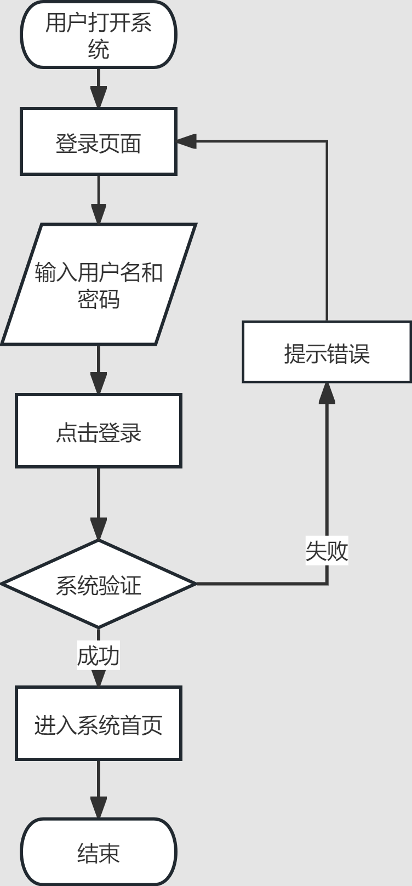</td>
</tr>
</tbody>
</table>

#### **功能描述**

<table>
<colgroup>
<col style="width: 13%" />
<col style="width: 17%" />
<col style="width: 29%" />
<col style="width: 38%" />
</colgroup>
<tbody>
<tr class="odd">
<td><p>功能名称（标识符）</p></td>
<td colspan="3">系统登陆（LG）</td>
</tr>
<tr class="even">
<td rowspan="4"><p>功</p>
<p>能</p>
<p>描</p>
<p>述</p></td>
<td>名称、标识符</td>
<td>执行角色</td>
<td>描述</td>
</tr>
<tr class="odd">
<td><p>用户登录</p>
<p>（LG-01）</p></td>
<td><p>全部用户</p></td>
<td>用户输入账号和密码进行身份认证，验证成功后进入系统首页</td>
</tr>
<tr class="even">
<td><p>忘记密码</p>
<p>（LG-02）</p></td>
<td><p>全部用户</p></td>
<td>用户在忘记密码时，通过身份验证流程重置账户密码。</td>
</tr>
<tr class="odd">
<td><p>记住账号</p>
<p>（LG-03）</p></td>
<td><p>全部用户</p></td>
<td>用户勾选后，系统在一定时间内保存登录状态或账号信息，方便下次快速登录。</td>
</tr>
</tbody>
</table>

### 用户管理

#### **业务流程**

（1）业务场景

为保证检测报告生成流程的安全性与规范性，系统需要对用户身份进行统一管理。

（2）业务流程

管理员在系统中创建用户账号。

（3）系统操作流程

1.  管理员进入“系统管理”-“用户管理”页面；系统展示当前用户列表及用户基本信息；

2.  管理员可通过“新增用户”功能创建新的系统用户，需填写基本信息（用户名、密码、所属部门等）；

3.  管理员可通过“批量导入”功能一次性导入多个用户信息；

4.  管理员可随时选择指定用户，对其信息进行编辑和修改；

5.  管理员可对指定用户执行启用/禁用或删除操作，控制用户账号状态；

6.  管理员可通过“导出”功能导出当前用户信息数据

7.  操作完成后系统自动保存并更新配置；

8. 管理员可通过筛选条件快速查询目标用户信息。

#### **功能描述**

<table>
<colgroup>
<col style="width: 15%" />
<col style="width: 20%" />
<col style="width: 15%" />
<col style="width: 48%" />
</colgroup>
<tbody>
<tr class="odd">
<td>功能名称</td>
<td colspan="3">用户管理（UM）</td>
</tr>
<tr class="even">
<td rowspan="9"><p>功</p>
<p>能</p>
<p>描</p>
<p>述</p></td>
<td>名称、标识符</td>
<td>执行角色</td>
<td>描述</td>
</tr>
<tr class="odd">
<td><p>查看用户信息</p>
<p>（UM -01）</p></td>
<td>管理员</td>
<td>查看系统用户列表及用户基本信息。</td>
</tr>
<tr class="even">
<td><p>新增用户</p>
<p>（UM -02）</p></td>
<td>管理员</td>
<td>创建新的系统用户账号</td>
</tr>
<tr class="odd">
<td><p>批量导入用户</p>
<p>（UM -03）</p></td>
<td>管理员</td>
<td>通过模板文件批量导入用户信息</td>
</tr>
<tr class="even">
<td><p>编辑用户信息</p>
<p>（UM -04）</p></td>
<td>管理员</td>
<td>修改用户基本信息</td>
</tr>
<tr class="odd">
<td><p>启用用户</p>
<p>（UM -05）</p></td>
<td>管理员</td>
<td>启用指定用户账号</td>
</tr>
<tr class="even">
<td><p>禁用用户</p>
<p>（UM -06）</p></td>
<td>管理员</td>
<td>禁用指定用户账号</td>
</tr>
<tr class="odd">
<td><p>导出用户信息</p>
<p>（UM -07）</p></td>
<td>管理员</td>
<td>导出系统用户数据</td>
</tr>
<tr class="even">
<td><p>删除用户</p>
<p>（UM -08）</p></td>
<td>管理员</td>
<td>删除系统用户账号</td>
</tr>
</tbody>
</table>

### 日志管理

#### **业务流程**

（1）业务场景

系统在项目管理、原始记录上传、规则配置、报告生成等业务过程中，会持续产生状态变化、操作反馈及系统运行信息。为了帮助用户及时掌握任务进展、了解业务执行结果，并为系统维护和问题追溯提供依据，系统设计了统一的消息与日志管理机制。其中，消息通知主要用于向用户反馈业务处理结果和系统状态信息；日志管理主要用于记录系统运行过程中的关键操作行为、解析过程及异常信息，实现业务全流程可追溯。

（2）业务流程

当用户完成登录、数据提交、报告生成、审核通过等操作后，系统根据业务处理结果自动生成对应消息通知，并通过页面右上角通知区域进行展示。用户可通过消息通知了解当前业务状态，也可通过消息中心查看历史消息记录。

同时，系统自动记录用户关键操作行为、系统运行状态以及大模型解析过程，形成系统日志和解析日志。管理员可通过日志管理模块查看相关记录，对系统运行情况进行监控与分析，并为异常问题排查和模型优化提供依据。

（3）系统操作流程

<table>
<colgroup>
<col style="width: 44%" />
<col style="width: 55%" />
</colgroup>
<tbody>
<tr class="odd">
<td><ol type="1">
<li><p>用户执行系统操作；</p></li>
<li><p>系统根据执行结果生成通知消息；</p></li>
<li><p>通知消息显示于页面右上角通知区域；</p></li>
<li><p>用户可手动关闭通知消息；</p></li>
<li><p>系统在设定时间后自动关闭通知消息；</p></li>
<li><p>多条消息同时存在时自动折叠显示；</p></li>
<li><p>用户可通过消息通知入口查看历史消息；</p></li>
</ol></td>
<td><ol type="1">
<li><p>用户在系统中执行业务操作；</p></li>
<li><p>系统自动记录相关操作日志及异常日志；</p></li>
<li><p>管理员进入日志管理模块；</p></li>
<li><p>根据条件筛选日志记录；</p></li>
<li><p>查看日志详情；</p></li>
<li><p>根据日志内容进行问题分析、运行维护或模型优化；</p></li>
</ol></td>
</tr>
<tr class="even">
<td>消息通知流程</td>
<td>日志管理流程</td>
</tr>
</tbody>
</table>

#### **功能描述**

<table>
<colgroup>
<col style="width: 13%" />
<col style="width: 22%" />
<col style="width: 15%" />
<col style="width: 48%" />
</colgroup>
<tbody>
<tr class="odd">
<td><p>功能名称</p>
<p>标识符</p></td>
<td colspan="3">消息通知管理（MM）</td>
</tr>
<tr class="even">
<td rowspan="6"><p>功</p>
<p>能</p>
<p>描</p>
<p>述</p></td>
<td>名称、标识符</td>
<td>执行角色</td>
<td>描述</td>
</tr>
<tr class="odd">
<td><p>消息通知展示</p>
<p>（MM-01）</p></td>
<td>系统</td>
<td>根据业务执行结果自动生成并展示通知消息</td>
</tr>
<tr class="even">
<td><p>自动关闭通知</p>
<p>（MM-02）</p></td>
<td>系统</td>
<td>通知消息在设定时间后自动消失</td>
</tr>
<tr class="odd">
<td><p>手动关闭通知</p>
<p>（MM-03）</p></td>
<td>全部用户</td>
<td>用户可主动关闭当前通知消息</td>
</tr>
<tr class="even">
<td><p>通知展开查看</p>
<p>（MM-04）</p></td>
<td>全部用户</td>
<td><p>多条通知同时存在时自动折叠显示</p>
<p>用户可移动鼠标自动展开消息查看当前通知</p></td>
</tr>
<tr class="odd">
<td><p>消息中心查看</p>
<p>（MM-05）</p></td>
<td>全部用户</td>
<td>查看历史通知消息记录</td>
</tr>
<tr class="even">
<td><p>功能名称</p>
<p>标识符</p></td>
<td colspan="3">解析日志管理（PL）</td>
</tr>
<tr class="odd">
<td rowspan="4"><p>功</p>
<p>能</p>
<p>描</p>
<p>述</p></td>
<td>名称、标识符</td>
<td>执行角色</td>
<td>描述</td>
</tr>
<tr class="even">
<td><p>日志查看</p>
<p>（PL-01）</p></td>
<td>管理员</td>
<td>查看日志列表信息内容</td>
</tr>
<tr class="odd">
<td><p>日志筛选</p>
<p>（PL-02）</p></td>
<td>管理员</td>
<td>对记录进行条件筛选</td>
</tr>
<tr class="even">
<td>查看日志详情（PL-03）</td>
<td>管理员</td>
<td>查看解析任务详细信息，包括Prompt摘要、大模型返回的结构化JSON结果、用户对解析结果的修正历史等</td>
</tr>
<tr class="odd">
<td><p>功能名称</p>
<p>标识符</p></td>
<td colspan="3">系统日志管理（SL）</td>
</tr>
<tr class="even">
<td rowspan="7"><p>功</p>
<p>能</p>
<p>描</p>
<p>述</p></td>
<td>名称、标识符</td>
<td>执行角色</td>
<td>描述</td>
</tr>
<tr class="odd">
<td><p>日志查看</p>
<p>（SL-01）</p></td>
<td>管理员</td>
<td>查看日志列表信息内容</td>
</tr>
<tr class="even">
<td><p>日志筛选</p>
<p>（SL-02）</p></td>
<td>管理员</td>
<td>对记录进行条件筛选</td>
</tr>
<tr class="odd">
<td>查看日志详情（SL-03）</td>
<td>管理员</td>
<td>查看具体操作记录及系统事件详情</td>
</tr>
<tr class="even">
<td><p>登录日志查看</p>
<p>（SL-04）</p></td>
<td>管理员</td>
<td>查看用户登录、退出系统等记录</td>
</tr>
<tr class="odd">
<td>操作日志查看（SL-05）</td>
<td>管理员</td>
<td>查看项目管理、规则配置、报告生成及审核流转等操作记录</td>
</tr>
<tr class="even">
<td>异常日志查看（SL-06）</td>
<td>管理员</td>
<td>查看系统异常及错误信息记录</td>
</tr>
</tbody>
</table>

**消息类型说明**

系统采用不同颜色区分通知消息类型：

- 绿色：表示操作成功、审核通过、保存成功等成功状态；

- 蓝色：表示流程引导、系统状态提示及操作说明；

- 黄色：表示警告、风险提示、备注说明及建议信息；

- 红色：表示操作失败、系统异常或需要联系管理员处理的问题。

---

## B. 项目管理

### 项目管理

#### 业务流程

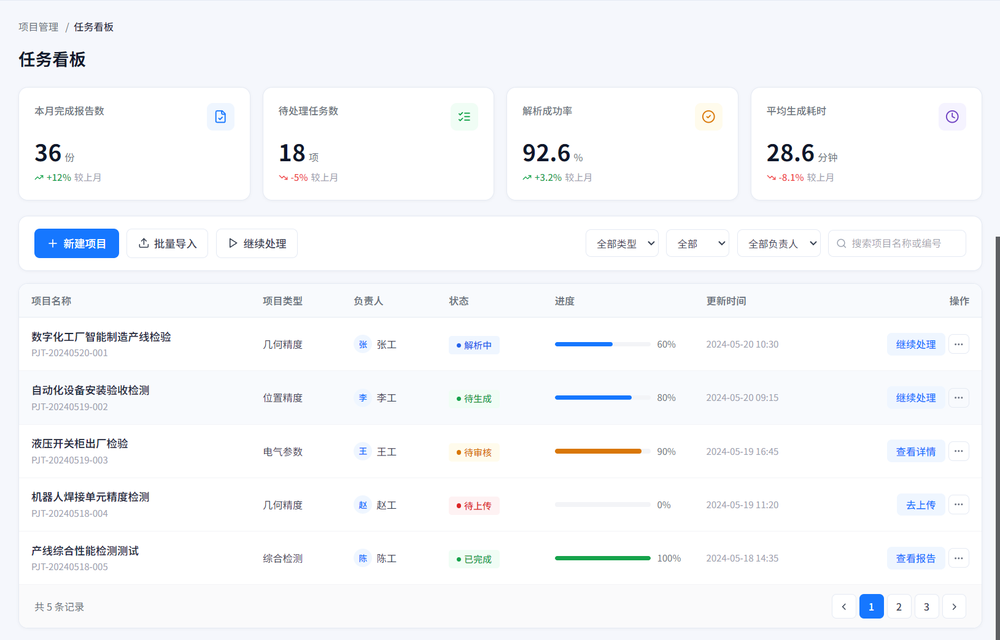

图1 项目管理任务看板页面

项目管理页面用于展示智能制造产线项目下的检测项目任务。页面左侧为系统导航栏，当前选中“项目管理”；顶部显示项目选择器、消息入口和当前用户信息；主工作区标题为“任务看板”。

**（1）**用户进入项目管理页面后，可在页面顶部查看本月完成报告数、待处理任务数、解析成功率、平均生成耗时等统计信息。

**（2）**用户可通过“新建项目”“批量导入”“继续处理”按钮进入对应操作入口。

**（3）**用户可通过全部类型、全部、全部负责人等下拉筛选项，以及项目名称或编号搜索框查找项目。

**（4）**页面下方以列表形式展示项目名称、项目类型、负责人、状态、进度、更新时间和操作入口。

**（5）**列表中可见的项目状态包括解析中、待生成、待审核、待上传、已完成。

#### 功能描述


图2 项目管理统计指标与操作筛选区

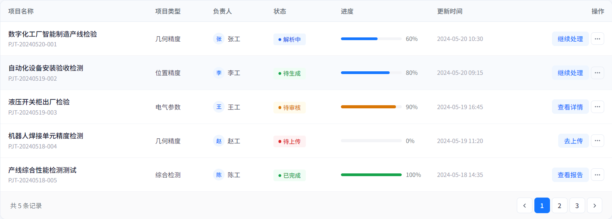

图3 项目列表、状态、进度与操作区

**（1）**统计指标功能：页面展示本月完成报告数 36 份、待处理任务数 18 项、解析成功率 92.6%、平均生成耗时 28.6 分钟，并显示较上月变化情况。

**（2）**项目操作功能：页面提供新建项目、批量导入、继续处理三个操作按钮，其中新建项目按钮为蓝色主按钮。

**（3）**筛选搜索功能：页面提供全部类型、全部、全部负责人三个下拉筛选控件，并提供项目名称或编号搜索框。

**（4）**项目列表功能：列表展示项目名称、项目编号、项目类型、负责人、状态、进度、更新时间和操作。

**（5）**项目状态显示功能：列表中通过不同颜色的状态标签展示解析中、待生成、待审核、待上传、已完成等状态。

**（6）**项目进度显示功能：列表中以进度条和百分比展示项目处理进度，如 60%、80%、90%、0%、100%。

**（7）**项目操作显示功能：操作列展示继续处理、查看详情、去上传、查看报告以及更多按钮。

**（8）**分页显示功能：列表底部显示共 5 条记录，并提供页码 1、2、3 及上一页、下一页按钮。

---

## C. 原始记录、规则配置

### C.1 原始记录上传与解析（RR）

#### 一、用户需求

##### 1.1 业务背景

智能检测报告生成系统用于将检测过程中的原始记录、测量数据、照片、表格文件等资料自动解析为结构化数据，并进一步支撑检测报告的自动生成和人工校核。

本页面对应系统左侧菜单中的 **“原始记录上传”** 模块，是检测报告生成链路中的前置核心页面。用户在该页面完成原始记录文件上传（支持多文件上传和文件夹上传）、检测类型（可根据文件名称自动检测，如果文件名称不对则fallback到手动选择）、文档解析、字段提取、大模型解析、解析结果预览、失败处理以及进入报告生成等操作。

##### 1.2 用户角色

| 角色 | 说明 | 主要操作权限 |
|---|---|---|
| 用户 | 负责上传原始记录并发起解析 | 上传所有相关文件、自动检测类型、查看解析进度、预览和更正解析结果、处理失败文件、进入报告生成 |
| 审核员 | 在后续流程中查看已解析数据与生成报告 | 查看解析结果、追溯原始文件 |
| 管理员 | 负责模板、规则和异常数据管理 | 查看全部项目原始记录、处理异常、维护模板、查看日志 |
| 系统/大模型服务 | 自动执行文件解析和字段抽取 | 文档识别、Word/Excel结构解析、表格检测、字段抽取、LLM解析、置信度计算、结构化存储 |

##### 1.3 业务目标

1. 支持用户在项目维度下上传多种格式的原始记录文件，支持多个文件同时上传和文件夹整个上传。
2. 根据文档名字确定检测类型，如果命名不规范则回退到手动选择。具体的解析逻辑在后端或者其他微服务。
3. 将接口返回的解析状态、字段提取状态、大模型解析状态和失败原因可视化展示。
4. 在解析成功后提供字段预览、字段值修改、字段详情查看和结果导出能力。
5. 在解析失败时提供明确原因和兜底处理入口，包括重新上传、重试解析、手动录入关键数据和联系管理员。
6. 为后续“报告生成”模块提供可信、可追溯、可人工修正的结构化数据。

---

#### 二、总体功能

##### 2.1 系统功能框图

原始记录上传与解析模块在系统中的位置如下：

```text
项目管理
  └── 选择项目
        └── 原始记录上传
              ├── 解析配置
              │     ├── 选择检测类型
              │     └── 选择原始记录模板
              ├── 文件上传
              │     ├── PDF
              │     ├── JPG/PNG
              │     ├── Word
              │     └── Excel
              ├── 文件管理
              │     ├── 预览
              │     ├── 删除
              │     └── 重试
              ├── 自动解析
              │     ├── 文档识别和结构解析
              │     ├── 表格检测
              │     ├── 字段提取和大模型解析
              │     ├── 置信度计算
              │     └── 结构化存储
              ├── 解析结果预览
              │     ├── 字段名称
              │     ├── 提取值
              │     └── 置信度
              ├── 异常处理
              │     ├── 重新上传
              │     ├── 手动录入
              │     └── 管理员处理
              └── 报告生成
```

##### 2.2 总体功能分类描述

| 类别/标识符 | 目标描述 |
|---|---|
| 原始记录上传与解析（RR） | 完成检测项目原始记录的上传、解析配置、文档解析、大模型字段提取、结构化存储、结果预览、异常处理和进入报告生成。 |

---

#### 三、原始记录上传与解析

##### 3.1 业务流程

用户进入系统后，首先在顶部项目下拉框中选择当前检测项目，例如“智能制造产线项目”。用户点击左侧菜单中的“原始记录上传”，进入原始记录上传与解析页面。

页面上方展示当前处理步骤，包括“上传文件”“OCR识别”“大模型提取”“结构化存储”。已完成步骤以成功状态展示，当前步骤以高亮状态展示，未完成步骤置灰展示。

用户在右侧“解析配置”区域选择检测类型，例如“几何精度”，并选择对应的原始记录模板，例如“几何精度检测原始记录模板”。系统根据所选模板加载字段定义、字段映射关系、字段校验规则和解析提示词。

用户可通过拖拽或点击按钮上传文件。系统支持 PDF、JPG、PNG、Word、Excel 等格式，并支持同一项目下多文件上传。上传成功后，文件进入“已上传文件”列表，列表展示文件名称、类型、大小、上传时间、OCR状态、解析状态和操作按钮。

系统根据文件类型执行不同解析流程。对于 PDF 和图片文件，系统先执行 OCR 识别和表格检测，再调用大模型提取字段；对于 Word 和 Excel 文件，系统优先执行结构化解析，再调用大模型进行字段归一化、字段补全和规则校验。解析过程中，页面展示开始时间、预计完成时间、已耗时、当前解析事件和字段提取进度。

当解析成功时，系统在“解析结果预览”区域展示已提取字段数量、字段名称、提取值和置信度，例如“检验项目=平面度”“测量位置=左侧工作面”“实测值=0.012 mm”“标准值=0.020 mm”“判定结果=合格”。用户可以点击“查看全部字段”进入完整字段详情页，也可以点击“导出结果”导出结构化数据。

当某个文件解析失败时，系统在页面底部显示红色失败处理提示区，展示失败文件名、失败原因和建议操作。用户可选择重新上传清晰文件、手动录入关键数据、联系管理员处理，或对该文件发起重试解析。

当必要字段达到报告生成要求后，用户可以点击页面右下角“生成报告”按钮，系统将当前项目、检测类型、模板、原始文件和结构化解析结果传递至报告生成模块。

##### 3.2 页面原型说明

| 区域 | 页面元素 | 说明 |
|---|---|---|
| 顶部导航栏 | 项目下拉框、消息通知、用户信息 | 支持切换当前项目，展示系统消息和当前登录用户。 |
| 左侧菜单栏 | 项目管理、原始记录上传、规则配置、报告生成、审核与流转、系统管理 | 当前页面“原始记录上传”高亮显示。 |
| 步骤进度条 | 上传文件、OCR识别、大模型提取、结构化存储 | 展示当前文件处理链路的整体进度。 |
| 文件上传区 | 拖拽上传框、选择文件按钮、已上传数量 | 支持用户拖拽或手动选择文件上传。 |
| 解析配置区 | 检测类型、原始记录模板、模板说明、查看模板示例 | 用于确定当前上传文件的业务类别和字段抽取规则。 |
| 已上传文件列表 | 文件名、类型、大小、上传时间、OCR状态、解析状态、操作 | 管理已上传文件并展示每个文件的识别与解析状态。 |
| 解析进度面板 | 开始时间、预计完成、已耗时、时间线 | 实时展示解析执行过程。 |
| 解析结果预览 | 字段名称、提取值、置信度、查看全部字段、导出结果 | 展示部分关键字段和置信度。 |
| 失败处理区 | 失败文件、失败原因、建议操作、去处理 | 对解析失败文件进行兜底处理。 |
| 页面操作区 | 生成报告 | 将解析结果传递到报告生成模块。 |


#### 页面截图与标注图

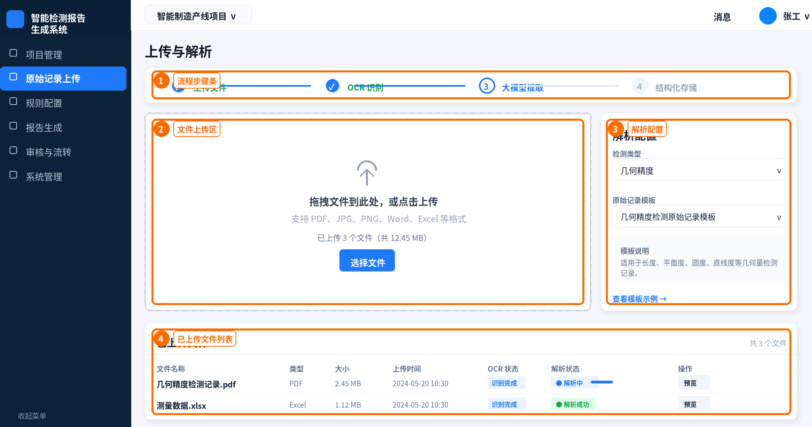

图C-1 原始记录上传与解析页面：上传区、步骤条与解析配置标注图

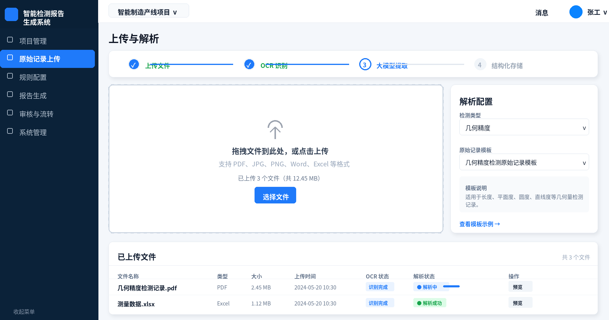

图C-2 原始记录上传与解析页面：上传配置区域重构图

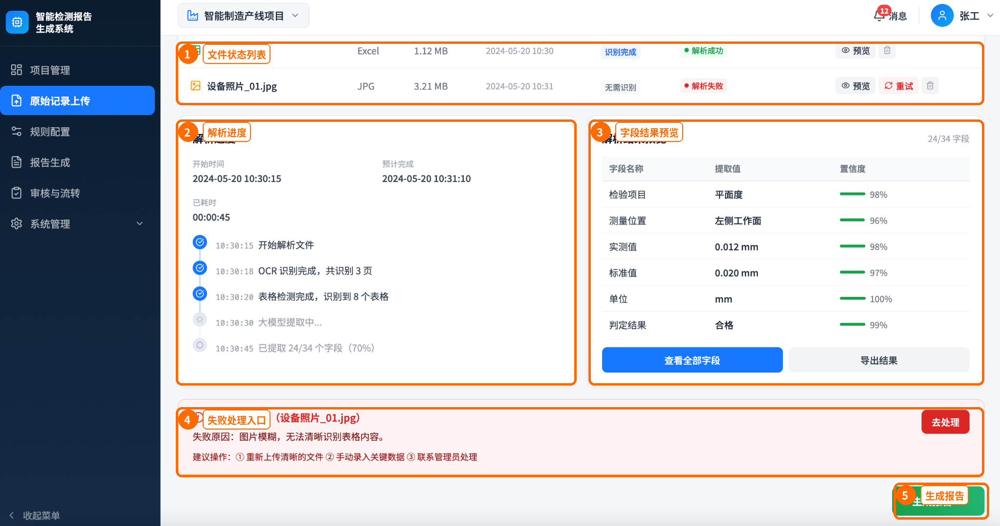

图C-3 原始记录上传与解析页面：解析进度、结果预览与失败处理标注图

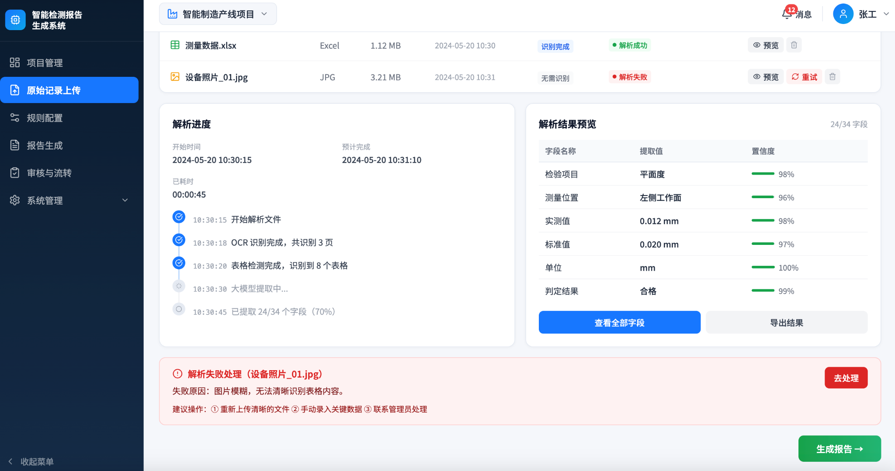

图C-4 原始记录上传与解析页面：解析中状态原始截图


图C-5 已上传文件列表、OCR状态、解析状态和操作区局部图

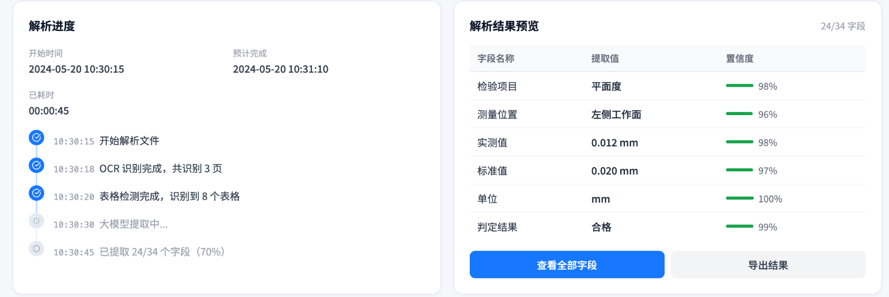

图C-6 解析进度与解析结果预览局部图


图C-7 解析失败处理提示区局部图


图C-8 生成报告按钮局部图

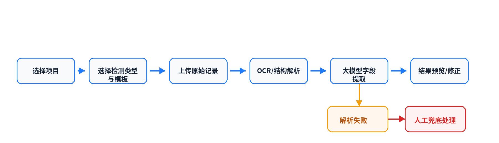

图C-9 原始记录上传与解析业务流程图


---

#### 四、功能描述

表4-1 原始记录上传与解析需求描述

| 功能名称标识符 | 原始记录上传与解析（RR） |
|---|---|
| 功能描述 | 支持项目原始记录文件上传、解析配置、文件状态查看、自动解析、字段结果预览、异常处理和进入报告生成。 |

| 名称、标识符 | 执行角色 | 描述 |
|---|---|---|
| 进入原始记录上传页面（RR-01） | 编制员/检测人员、管理员 | 用户从左侧菜单进入“原始记录上传”页面，系统加载当前项目、上传记录、解析状态和默认解析配置。 |
| 切换当前项目（RR-02） | 编制员/检测人员、管理员 | 用户可通过顶部项目下拉框切换当前检测项目，页面应刷新该项目下的原始记录文件、解析状态和可用模板。 |
| 选择检测类型（RR-03） | 编制员/检测人员、管理员 | 用户在解析配置区选择检测类型，例如几何精度、位置精度、电气参数等。检测类型将影响可选模板、字段集合和解析规则。 |
| 选择原始记录模板（RR-04） | 编制员/检测人员、管理员 | 用户选择对应的原始记录模板。系统根据模板加载字段定义、字段映射、校验规则和模板说明。 |
| 查看模板说明（RR-05） | 编制员/检测人员、管理员 | 系统展示当前模板适用范围，例如适用于长度、平面度、圆度、直线度等几何量检测记录。 |
| 查看模板示例（RR-06） | 编制员/检测人员、管理员 | 用户点击“查看模板示例”后，系统展示模板样例、字段说明和推荐上传格式。 |
| 上传原始记录文件（RR-07） | 编制员/检测人员、管理员 | 用户通过拖拽或点击“选择文件”上传原始记录。系统应支持PDF、JPG、PNG、Word、Excel等格式，并支持多文件上传。 |
| 上传文件合法性校验（RR-08） | 系统 | 系统校验文件格式、文件大小、文件名、重复文件、空文件、损坏文件和项目权限。不合法文件不得进入解析队列，并应给出明确提示。 |
| 查看已上传文件列表（RR-09） | 编制员/检测人员、管理员 | 用户查看当前项目下已上传文件，列表显示文件名称、类型、大小、上传时间、OCR状态、解析状态和操作按钮。 |
| 预览原始文件（RR-10） | 编制员/检测人员、审核员、管理员 | 用户点击“预览”后查看原始文件内容。PDF和图片以预览器展示，Word和Excel可转换为在线预览格式。 |
| 删除上传文件（RR-11） | 编制员/检测人员、管理员 | 用户可删除未进入报告生成或未被审核锁定的文件。删除前系统应二次确认，并保留操作日志。 |
| 重试解析文件（RR-12） | 编制员/检测人员、管理员 | 当文件解析失败或解析结果异常时，用户可点击“重试”重新进入解析队列。 |
| OCR识别/文档结构解析（RR-13） | 系统 | 系统根据文件类型执行OCR识别或结构化文档解析。PDF和图片执行OCR与表格检测；Word和Excel优先读取文本、表格和单元格结构。 |
| 大模型字段提取（RR-14） | 系统 | 系统根据检测类型、模板字段、原始内容和规则提示词，调用大模型提取结构化字段，包括检验项目、测量位置、实测值、标准值、单位、判定结果等。 |
| 结构化存储（RR-15） | 系统 | 系统将原始文件信息、OCR文本、解析中间结果、最终字段、置信度、来源位置和处理日志存入数据库。 |
| 查看解析进度（RR-16） | 编制员/检测人员、管理员 | 用户可查看开始时间、预计完成时间、已耗时、当前进度事件和字段提取比例。 |
| 查看解析结果预览（RR-17） | 编制员/检测人员、审核员、管理员 | 系统在解析结果预览区域展示关键字段、提取值和置信度，支持用户快速判断解析质量。 |
| 查看全部字段（RR-18） | 编制员/检测人员、审核员、管理员 | 用户点击“查看全部字段”后进入字段详情页，查看全部提取字段、来源文件、来源页码、置信度和校验状态。 |
| 导出解析结果（RR-19） | 编制员/检测人员、管理员 | 用户可导出结构化解析结果，导出格式可包括Excel、JSON或系统内部数据包。 |
| 解析失败提示（RR-20） | 系统 | 当文件解析失败时，系统展示失败文件名、失败原因和建议操作，例如图片模糊、表格无法识别、模板不匹配、关键字段缺失等。 |
| 手动录入关键数据（RR-21） | 编制员/检测人员、管理员 | 对于无法自动解析的文件，用户可进入人工录入页面补充必要字段，人工录入数据应标记来源为“手动录入”。 |
| 联系管理员处理（RR-22） | 编制员/检测人员 | 用户可将异常文件和错误日志提交给管理员处理。管理员可查看原始文件、解析日志、模型返回结果和失败原因。 |
| 进入报告生成（RR-23） | 编制员/检测人员、管理员 | 当必要字段满足报告生成条件后，用户点击“生成报告”，系统将结构化数据传递给报告生成模块。 |

---

### C.2 规则配置与模板管理（RC）

#### 一、用户需求

##### 1.1 业务背景

规则配置与模板管理模块用于维护检测报告生成所依赖的模板字段、字段来源、判定规则、计算公式、结论模板和版本记录，是系统从“原始记录解析结果”到“报告内容自动生成”的规则中枢。该页面对应左侧菜单中的 **“规则配置”**，当前截图展示的是“规则配置 / 模板管理”页面。

在检测报告生成场景中，不同检测类型对应不同的字段体系和判定逻辑。例如平面度检测模板需要维护“检验项目、测量位置、实测值、标准值、单位、判定结果、结论、备注”等字段，并需要明确每个字段来自固定值、原始记录、计算字段、规则生成或人工填写。系统必须通过可配置模板完成这些差异管理，避免将字段映射和判定逻辑写死在代码中。

##### 1.2 用户角色

| 角色 | 说明 | 主要操作权限 |
|---|---|---|
| 管理员 | 负责维护模板库、规则、字段、版本与发布状态 | 新建模板、编辑模板、复制模板、删除字段、保存规则、发布版本、回滚版本、查看全部模板 |
| 编制员 | 在报告编制过程中使用已发布模板和规则 | 查看模板、查看字段定义、查看规则说明、选择模板生成报告 |
| 审核员 | 在审核报告时追溯报告字段来源和规则版本 | 查看模板字段、查看判定依据、查看规则版本，不直接修改规则 |
| 系统 | 在原始记录解析和报告生成时调用规则 | 加载生效版本、执行字段映射、执行判定规则、生成结论、记录调用日志 |

##### 1.3 业务目标

1. 支持按检测类型维护模板库，包括封面模板、几何精度、位置精度、电气参数、力学性能、综合检测、报告结论、结尾模板等分类。
2. 支持查看、创建、复制和编辑具体检测模板，例如“平面度检测模板”。
3. 支持配置模板字段定义，包括字段名称、字段编码、字段类型、是否必填、数据来源、显示格式、校验规则和示例值。
4. 支持配置判定规则，例如“当实测值 ≤ 标准值时，判定为合格；否则判定为不合格”。
5. 支持配置计算公式，例如“(实测值 - 标准值) / 标准值 * 100”。
6. 支持管理模板版本，包括版本号、版本名称、变更内容、创建人、创建时间、状态、预览、复制和回滚。
7. 支持规则保存、发布、生效、归档和回滚，保证报告生成结果可追溯。

---

#### 二、总体功能

##### 2.1 系统功能框图

```text
规则配置与模板管理
  ├── 模板库管理
  │     ├── 模板搜索
  │     ├── 模板分类树
  │     ├── 新建模板
  │     ├── 编辑模板
  │     └── 复制模板
  ├── 模板详情
  │     ├── 模板预览
  │     ├── 字段定义
  │     ├── 数据来源
  │     └── 版本管理
  ├── 字段定义管理
  │     ├── 字段名称
  │     ├── 字段编码
  │     ├── 字段类型
  │     ├── 是否必填
  │     ├── 数据来源
  │     ├── 显示格式
  │     ├── 校验规则
  │     └── 示例值
  ├── 规则编辑器
  │     ├── 溯源表
  │     ├── 判定规则
  │     ├── 结论模板
  │     ├── 条件配置
  │     ├── 计算公式
  │     └── 保存规则
  └── 版本管理
        ├── 版本列表
        ├── 生效状态
        ├── 版本预览
        ├── 版本复制
        └── 版本回滚
```

##### 2.2 总体功能分类描述

| 类别/标识符 | 目标描述 |
|---|---|
| 规则配置与模板管理（RC） | 完成模板库分类、模板详情查看、字段定义维护、数据来源配置、判定规则配置、结论模板配置、规则保存和版本管理，为原始记录解析、报告生成和审核追溯提供规则依据。 |

---

#### 三、规则配置与模板管理

##### 3.1 业务流程

管理员进入系统后，点击左侧菜单中的“规则配置”，进入“规则配置 / 模板管理”页面。页面左侧为模板库区域，支持搜索模板名称，并按业务分类展示模板树。截图中模板库包括封面模板、几何精度、位置精度、电气参数、力学性能、综合检测、报告结论和结尾模板等分类，其中“几何精度”分类下包含平面度检测模板、直线度检测模板、圆度检测模板、平行度检测模板、垂直度检测模板等模板。

管理员选择“平面度检测模板”后，系统在中间区域展示模板详情。模板详情顶部展示模板名称、当前版本号和更新时间，例如“当前版本：v2.1.0，2024-05-18 更新”。模板详情区域提供“编辑模板”和“复制”按钮，并通过标签页展示“模板预览、字段定义、数据来源、版本管理”等内容。

在“字段定义”标签页中，系统以表格形式展示模板字段。字段表包含字段名称、字段类型、是否必填、数据来源和操作。截图中字段包括检验项目、测量位置、实测值、标准值、单位、判定结果、结论和备注；字段类型包括文本和数值；数据来源包括固定值、原始记录、计算字段、规则生成和人工填写。管理员可对字段执行编辑和删除操作。

当管理员选中“实测值”字段后，页面下方展示字段详情，包括字段编码 `actual_value`、字段类型“数值（保留3位小数）”、数据来源“原始记录 → 测量结果 → 实测值”、校验规则“必填，数值范围 -9999 ~ 9999”、显示格式 `{value} mm` 和示例值 `0.012`。

页面右侧为规则编辑器，包含“溯源表、判定规则、结论模板”三个标签页。当前截图展示的是“判定规则”配置。管理员可配置条件：“当实测值 ≤ 标准值时，判定为合格；否则判定为不合格”，并可通过“添加条件”扩展判定逻辑。规则编辑器下方提供计算公式输入区域，示例公式为“(实测值 - 标准值) / 标准值 * 100”，管理员点击“保存规则”后，系统保存当前判定规则和计算公式。

在页面下方的“版本管理”区域，系统展示模板历史版本，包括版本号、版本名称、变更内容、创建人、创建时间、状态和操作。截图中存在 v2.1.0、v2.0.0、v1.0.0 三个版本，其中 v2.1.0 状态为“生效中”，v2.0.0 状态为“已发布”，v1.0.0 状态为“已归档”。管理员可对历史版本进行预览、复制和回滚操作。

##### 3.2 系统操作流程

1. 管理员进入“规则配置 / 模板管理”页面；
2. 系统加载当前项目、左侧导航栏、模板库分类树和默认选中模板；
3. 管理员通过模板搜索框或模板分类树查找目标模板；
4. 管理员选择具体模板，例如“平面度检测模板”；
5. 系统展示模板详情、当前版本、更新时间、字段定义、规则编辑器和版本管理信息；
6. 管理员在“字段定义”标签页查看字段名称、字段类型、必填状态、数据来源和操作入口；
7. 管理员选择某一字段，系统在字段详情区展示字段编码、数据来源、字段类型、校验规则、显示格式和示例值；
8. 管理员点击“编辑”修改字段定义，或点击“删除”删除非受保护字段；
9. 管理员在右侧规则编辑器中切换“溯源表、判定规则、结论模板”标签页；
10. 管理员在“判定规则”中配置条件表达式、合格/不合格结果和计算公式；
11. 管理员点击“保存规则”，系统保存规则内容并记录操作日志；
12. 管理员在版本管理区域查看历史版本，必要时执行预览、复制或回滚；
13. 当规则发布或版本回滚后，系统更新当前生效版本，并供报告生成模块调用。

##### 3.3 页面原型说明

| 区域 | 页面元素 | 说明 |
|---|---|---|
| 顶部导航栏 | 项目选择器、消息通知、用户信息 | 展示当前项目“智能制造产线项目”、消息入口和当前用户。 |
| 左侧系统菜单 | 项目管理、原始记录上传、规则配置、报告生成、审核与流转、系统管理 | 当前页面“规则配置”高亮显示。 |
| 面包屑与标题区 | 规则配置 / 模板管理、模板管理 | 标识当前页面层级和主功能。 |
| 模板库区域 | 搜索模板名称、模板分类树、新建模板 | 支持按名称搜索模板，并按检测类型组织模板。 |
| 模板详情区 | 模板名称、版本号、更新时间、编辑模板、复制 | 展示当前选中模板的基础信息和模板级操作。 |
| 模板详情标签页 | 模板预览、字段定义、数据来源、版本管理 | 支持在模板预览、字段、来源和版本之间切换。 |
| 字段定义表 | 字段名称、字段类型、是否必填、数据来源、操作 | 展示模板字段列表，并支持字段编辑和删除。 |
| 字段详情区 | 字段编码、数据来源、显示格式、字段类型、校验规则、示例值 | 展示当前选中字段的详细配置。 |
| 规则编辑器 | 溯源表、判定规则、结论模板 | 在页面右侧固定展示规则配置工具。 |
| 判定规则配置 | 条件字段、比较符、目标字段、合格结果、不合格结果 | 支持配置“实测值 ≤ 标准值”等规则。 |
| 计算公式区 | 公式输入框、插入字段 | 支持维护派生计算公式。 |
| 保存规则按钮 | 保存规则 | 保存当前规则配置。 |
| 版本管理区 | 版本号、版本名称、变更内容、创建人、创建时间、状态、操作 | 管理规则模板历史版本，支持预览、复制、回滚。 |

##### 3.4 页面截图与标注图

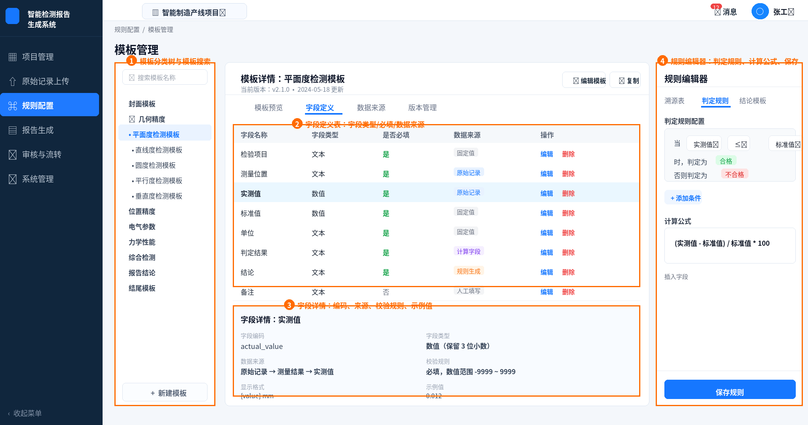

图C-10 规则配置与模板管理页面：模板库、字段定义、字段详情与规则编辑器标注图

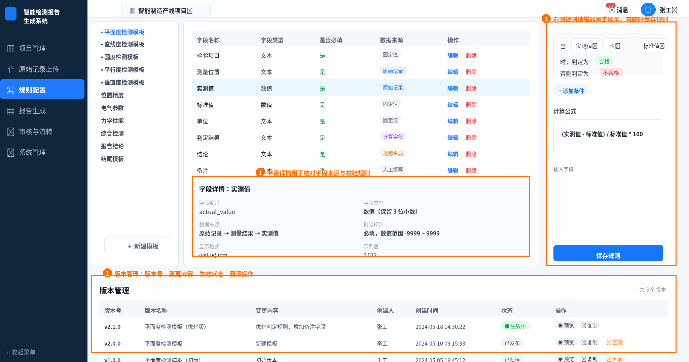

图C-11 规则配置与模板管理页面：版本管理与规则编辑器标注图


图C-12 模板分类树与新建模板入口局部图

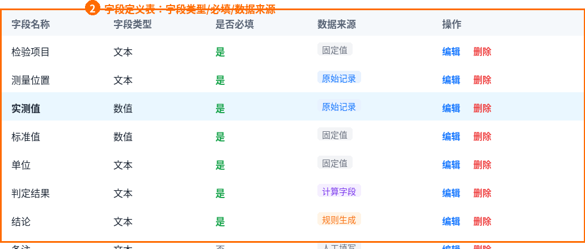

图C-13 字段定义表局部图


图C-14 规则编辑器局部图


图C-15 版本管理列表局部图

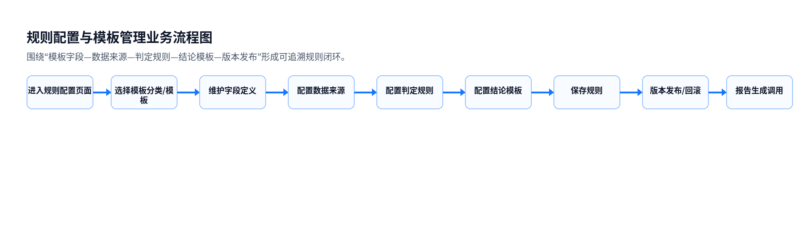

图C-16 规则配置与模板管理业务流程图

---

#### 四、功能描述

表4-2 规则配置与模板管理需求描述

| 功能名称标识符 | 规则配置与模板管理（RC） |
|---|---|
| 功能描述 | 支持模板库管理、模板详情查看、字段定义维护、字段详情查看、数据来源配置、判定规则配置、计算公式配置、结论模板配置、规则保存、模板复制、版本管理和规则调用追溯。 |

| 名称、标识符 | 执行角色 | 描述 |
|---|---|---|
| 进入模板管理页面（RC-01） | 管理员、编制员、审核员 | 用户点击左侧菜单“规则配置”进入模板管理页面，系统加载当前项目、模板库、默认模板、字段定义和规则编辑器。 |
| 搜索模板（RC-02） | 管理员、编制员、审核员 | 用户可在模板库搜索框中输入模板名称，系统根据关键词筛选匹配模板。 |
| 查看模板分类树（RC-03） | 管理员、编制员、审核员 | 系统按封面模板、几何精度、位置精度、电气参数、力学性能、综合检测、报告结论、结尾模板等分类展示模板。 |
| 选择模板（RC-04） | 管理员、编制员、审核员 | 用户点击具体模板后，系统加载模板详情、字段定义、规则配置和版本管理信息。 |
| 新建模板（RC-05） | 管理员 | 管理员点击“新建模板”创建模板，填写模板名称、所属分类、适用检测类型、初始字段和规则说明。 |
| 编辑模板（RC-06） | 管理员 | 管理员点击“编辑模板”修改模板基本信息、字段定义、数据来源、规则和结论模板。 |
| 复制模板（RC-07） | 管理员 | 管理员点击“复制”基于当前模板生成副本，便于快速创建相似检测模板。 |
| 查看模板当前版本（RC-08） | 管理员、编制员、审核员 | 系统展示当前模板版本号、更新时间和生效状态，例如 v2.1.0、2024-05-18 更新。 |
| 查看模板预览（RC-09） | 管理员、编制员、审核员 | 用户切换到“模板预览”查看模板整体结构、预期字段和生成效果。 |
| 查看字段定义（RC-10） | 管理员、编制员、审核员 | 用户在“字段定义”标签页查看字段名称、字段类型、是否必填、数据来源和操作列。 |
| 新增字段（RC-11） | 管理员 | 管理员可新增模板字段，配置字段名称、字段编码、字段类型、必填状态、数据来源、默认值、单位和显示格式。 |
| 编辑字段（RC-12） | 管理员 | 管理员可修改字段定义，调整字段类型、数据来源、校验规则、显示格式和示例值。 |
| 删除字段（RC-13） | 管理员 | 管理员可删除非系统保护字段。删除前系统应二次确认，并检查该字段是否被规则或报告模板引用。 |
| 查看字段详情（RC-14） | 管理员、编制员、审核员 | 用户选择字段后，系统展示字段编码、数据来源路径、显示格式、字段类型、校验规则和示例值。 |
| 配置字段数据来源（RC-15） | 管理员 | 管理员为字段配置数据来源，支持固定值、原始记录、计算字段、规则生成和人工填写。 |
| 配置字段校验规则（RC-16） | 管理员 | 管理员配置字段必填性、数值范围、精度、单位、格式表达式和异常提示。 |
| 查看溯源表（RC-17） | 管理员、审核员 | 用户在规则编辑器中查看字段来源链路，例如原始记录字段到报告字段的映射关系。 |
| 配置判定规则（RC-18） | 管理员 | 管理员在“判定规则”标签页配置条件表达式、比较符、目标字段、合格结果和不合格结果。 |
| 添加判定条件（RC-19） | 管理员 | 管理员点击“添加条件”扩展多条件判断，支持与、或、括号和优先级配置。 |
| 配置计算公式（RC-20） | 管理员 | 管理员在公式输入区配置计算公式，支持插入字段、四则运算、百分比计算、单位换算和函数表达式。 |
| 配置结论模板（RC-21） | 管理员 | 管理员在“结论模板”标签页配置合格、不合格、需复核、数据缺失等场景的标准话术。 |
| 保存规则（RC-22） | 管理员 | 管理员点击“保存规则”保存当前判定规则、计算公式和结论模板，系统记录保存人、保存时间和变更内容。 |
| 规则合法性校验（RC-23） | 系统 | 系统在保存前校验字段引用、公式语法、数据类型、必填字段、循环依赖和规则冲突。 |
| 查看版本管理（RC-24） | 管理员、编制员、审核员 | 用户查看模板历史版本列表，包括版本号、版本名称、变更内容、创建人、创建时间、状态和操作。 |
| 预览历史版本（RC-25） | 管理员、编制员、审核员 | 用户点击“预览”查看历史版本的字段定义、规则内容和结论模板。 |
| 复制历史版本（RC-26） | 管理员 | 管理员可复制历史版本作为新模板或新草稿。 |
| 回滚历史版本（RC-27） | 管理员 | 管理员可将已发布或已归档版本回滚为当前生效版本，系统应生成新的版本记录并保留回滚日志。 |
| 管理版本状态（RC-28） | 管理员、系统 | 系统支持生效中、已发布、已归档等状态管理，并保证同一模板同一时间仅有一个生效版本。 |
| 规则调用追溯（RC-29） | 系统、管理员、审核员 | 报告生成和审核时可追溯所使用的模板ID、版本号、字段规则、判定规则和结论模板。 |

---

## D. 报告生成

### D.1 总体功能分类

本部分涵盖智能检测报告生成系统中的"报告生成与编辑"。

| 序号 | 模块名称 | 标识符 | 模块说明 |
|:---:|:---|:---:|:---|
| 1 | 报告生成与编辑 | RG | 基于解析结果和规则模板，自动生成标准化检测报告初稿，提供富文本编辑器和AI智能助手辅助编制人员进行报告编辑、审校、预览与导出 |

---

### D.2 报告生成与编辑（RG）

#### 业务流程

**场景描述：**
编制人员在原始记录解析完成并通过规则配置后，进入报告生成模块。系统根据项目信息自动加载默认配置，编制人员选择需要纳入报告的检测项，确认封面基本信息（委托单位、样品名称、型号规格、检测日期、报告日期等），系统据此从解析结果数据库中拉取对应检测数据，按规则模板自动填充至报告各章节，生成报告初稿。

**业务流程：**
1. 编制人员从项目管理页面进入"报告生成"功能；
2. 系统根据项目ID自动加载默认报告模板和可用的检测项列表；
3. 编制人员根据实际需求调整模板类型、勾选检测项；
4. 编制人员点击"生成报告"，系统调用规则引擎将解析数据与模板组装，生成报告初稿；
5. 系统自动生成报告目录树结构（封面→检验结论→各检测项章节→附件）；
6. 编制人员在富文本编辑器中对报告正文进行编辑、排版和数据调整；
7. 编制人员可调用右侧智能助手的agent功能优化报告质量；
8. 系统实时检测报告内容中的待优化项，在页面底部给出提示；
9. 编制人员完成编辑后可预览报告效果、导出Word文件或提交审核。

**系统操作流程：**
1. 进入报告生成页面 → 页面顶部展示生成配置区域（报告模板上传解析、检测项勾选、生成报告）；
2. 配置完成并点击"生成报告" → 左侧目录树自动生成，中间编辑区加载报告初稿内容，右侧智能助手面板就绪；
3. 在编辑区选中目录节点 → 编辑区定位至对应章节，可对标题、正文文本、检测结果表格、图片进行编辑；
4. 点击智能助手功能按钮 → 调用大模型接口，返回优化建议卡片，编制人员可逐条查看并"应用到正文"；
5. 点击工具栏"预览" → 全屏展示报告完整效果（只读模式）；
6. 点击工具栏"导出Word" → 系统校验完整性后生成.docx文件并下载；
7. 点击工具栏"提交审核" → 系统校验通过后锁定报告，状态更新为"待审核"，通知审核人。

#### 功能描述

| 功能名称、标识符 | 执行角色 | 描述 |
|:---|:---|:---|
| 生成报告配置（RG-01） | 编制人员 | 选择上传检测报告模板（或者选择已有模板），勾选需纳入报告的检测项（几何精度、位置精度、电气参数、参数检验等），系统校验必填项完整性后生成报告初稿 |
| 报告目录管理（RG-02） | 编制人员 | 以树形结构展示报告目录层级（封面→检验结论→各检测项子章节→附件），支持点击目录节点跳转至对应章节，支持章节展开/收起，支持通过"+ 添加章节"按钮自定义补充章节 |
| 报告正文编辑（RG-03） | 编制人员 | 提供富文本编辑器支持正文/标题样式切换、字体格式化（加粗/斜体/下划线/字号/颜色）、对齐方式、有序/无序列表、表格插入与编辑、图片插入与自动编号、撤销/重做等操作；底部提供备注区域 |
| 智能助手（RG-04） | 编制人员 | 右侧面板提供AI辅助功能，如果需要改动可以直接用自然语言描述调用大模型自动修改；系统还可以主动推送优化建议卡片（如"建议补充依据标准：GB/T 1958-2017"），编制人员可点击"应用到正文"确认采纳。 |
| 版本管理（RG-05） | 编制人员 | 报告编辑过程中自动保存（停止输入后5秒触发），支持手动保存草稿；版本历史列表展示版本号（V1.0/V1.1...）、操作人、保存时间、变更说明；支持任意两个版本之间的差异对比（新增/删除/修改高亮）和恢复至指定历史版本 |
| 报告预览（RG-06） | 编制人员 | 全屏或弹窗模式预览报告完整效果，包括封面、目录、正文、附件等内容，模拟最终输出的排版和格式，预览模式下内容只读不可编辑，支持页码导航和缩放 |
| 报告导出（RG-07） | 编制人员 | 将编辑完成的报告导出为标准Word文档（.docx格式），保持字体、段落、表格样式和图片完整性，导出前自动校验报告必填内容完整性并保存当前编辑，文件命名规则为"{项目名称}_检测报告.docx" |
| 提交审核（RG-08） | 编制人员 | 报告编辑完成后提交至审核流转模块，系统校验封面信息完整性、检测数据和结论一致性，校验通过后报告状态由"已生成初稿"更新为"待审核"并进入锁定状态，自动通知审核人，提交操作记录至操作日志 |
| 保存草稿（RG-09） | 编制人员 | 手动保存当前编辑进度为草稿状态，系统立即保存全部编辑内容并创建新版本记录，不触发审核流程 |
| 优化建议提示（RG-10） | 编制人员 | 系统实时检测报告内容中的潜在问题（术语不规范、数据异常、格式错误等），在页面底部显示"存在N处建议优化内容"提示条，点击可查看优化建议列表并逐条处理或忽略 |

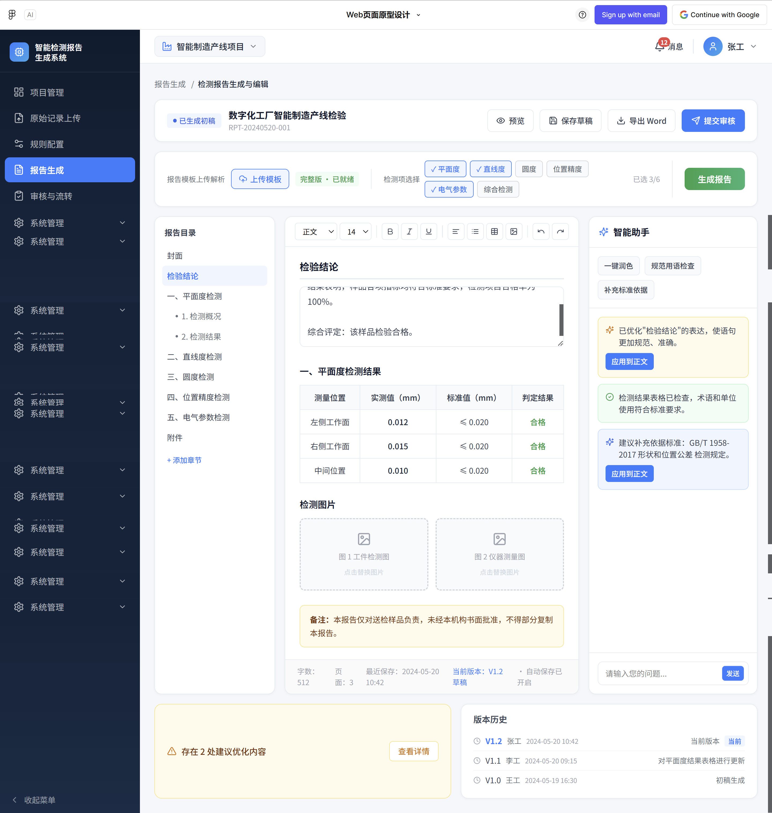

---
